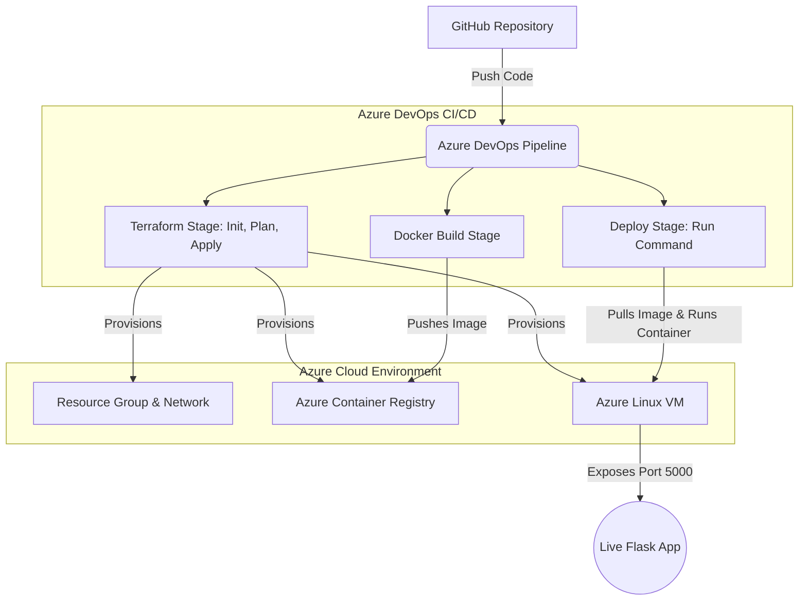
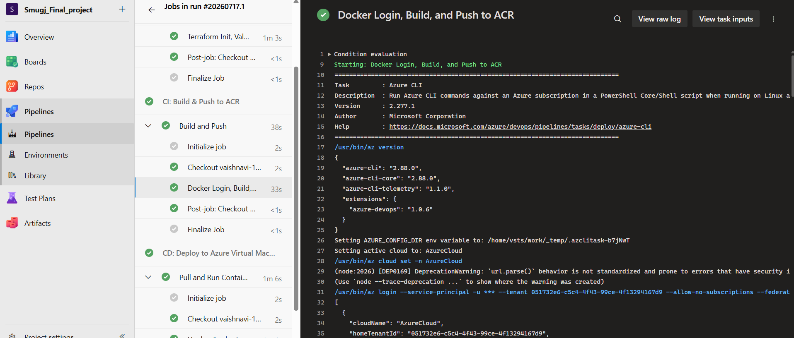
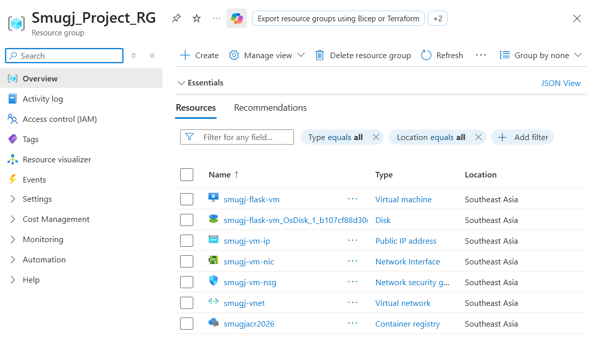
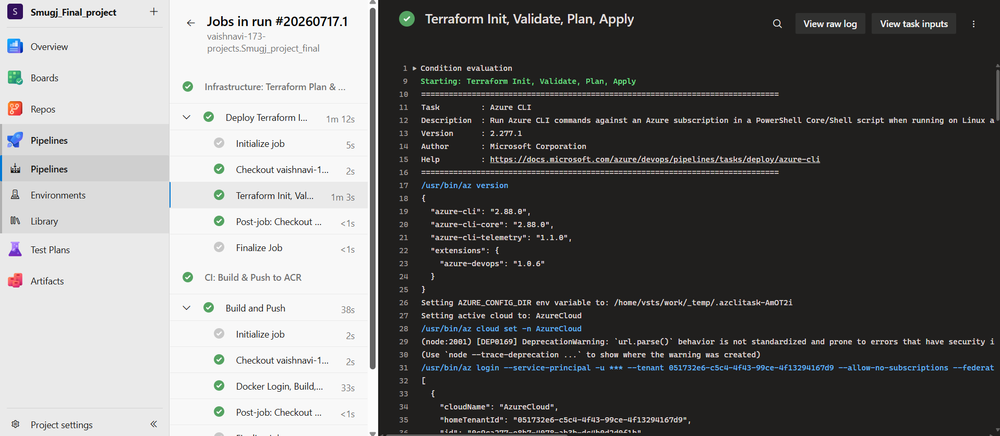
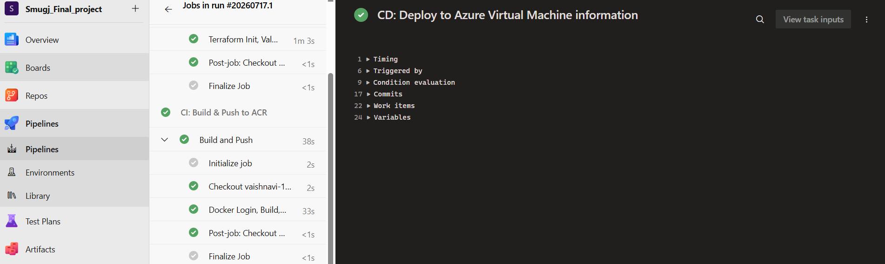
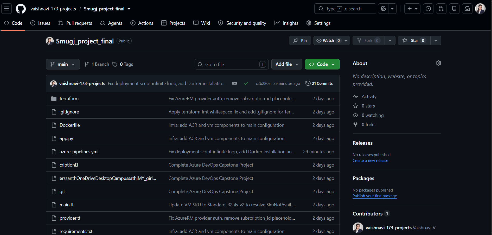

# 🚀 Smugj – Automated CI/CD Deployment using Azure DevOps, Terraform & Docker


---

## 📖 Project Description

**Smugj** is an automated cloud infrastructure and continuous deployment (CI/CD) project designed to provision, build, and deploy a Python Flask application onto Microsoft Azure. It uses **Terraform** as Infrastructure as Code (IaC) to create a scalable network, an Azure Container Registry (ACR), and a Linux Virtual Machine. **Azure DevOps** drives the pipeline, handling everything from testing and image building to secure container deployment directly to the VM.

---

## ✨ Project Highlights

- **Infrastructure as Code (IaC)** using Terraform
- **Azure DevOps CI/CD** for zero-downtime automated workflows
- **Azure Virtual Machine** configured securely with NSGs and Docker runtime
- **Azure Container Registry (ACR)** for private image hosting
- **Docker Deployment** ensuring environment consistency
- **Flask Application** running as the core microservice
- **GitHub Integration** triggering the pipeline on push
- **Automated Cloud Deployment** from code commit to live service

---

## 🏛️ Architecture



---

## 📂 Repository Structure

```text
.
├── app/                  # Application source code
│   └── app.py            # Main Flask application entrypoint
├── terraform/            # Infrastructure as Code files
│   ├── main.tf           # Azure resources definitions
│   ├── variables.tf      # Variable declarations
│   ├── terraform.tfvars  # Variable assignments
│   └── provider.tf       # Azure provider setup
├── pipeline/             # CI/CD configuration
│   └── azure-pipelines.yml # Azure DevOps pipeline definition
├── docs/                 # Documentation and screenshots
├── Dockerfile            # Instructions for building the app container
├── requirements.txt      # Python dependencies
└── README.md             # Project documentation
```

---

## ⚙️ Prerequisites

To run this project or configure your own pipeline, you will need:
- An active **Azure Subscription** (e.g., Azure for Students)
- An **Azure DevOps** account linked to your subscription
- **Terraform CLI** installed locally (for testing)
- **Azure CLI** installed and authenticated (`az login`)
- **Docker** installed locally (optional, for local testing)

---

## 🚀 Installation

1. **Clone the repository:**
   ```bash
   git clone https://github.com/vaishnavi-173-projects/Smugj_project_final.git
   cd Smugj_project_final
   ```

2. **Test locally with Docker:**
   ```bash
   docker build -t smugj-flask-app .
   docker run -p 5000:5000 smugj-flask-app
   ```
   Navigate to `http://localhost:5000` to view the app.

---

## 🏗️ Terraform Deployment

The infrastructure is defined in the `terraform/` directory.

```bash
cd terraform
# Initialize Terraform and configure Azure backend
terraform init

# Validate configuration
terraform validate

# Preview infrastructure changes
terraform plan

# Apply infrastructure changes (handled automatically by the pipeline)
terraform apply -auto-approve
```

---

## 🔄 Azure DevOps Pipeline

The continuous integration and deployment logic is defined in `pipeline/azure-pipelines.yml`. It consists of three stages:

1. **Terraform**: Secures backend state, installs Terraform, authenticates via Workload Identity Federation (WIF), and provisions all required Azure resources (ACR, VM, VNet).
2. **Build**: Authenticates with ACR, builds the Docker image from the source code, and pushes it to the registry.
3. **Deploy**: Resolves the VM's Public IP, generates a secure deployment script, and safely invokes it using `az vm run-command invoke`. This script installs Docker (if missing), logs into ACR, stops old containers, and spins up the new application container.

---

## 🛤️ Deployment Workflow

**GitHub** ➔ **Azure DevOps** ➔ **Terraform** ➔ **Azure Resources** ➔ **Docker Build** ➔ **Azure Container Registry** ➔ **Azure VM** ➔ **Flask App**

---

## 📸 Screenshots

*(Placeholders for future implementation screenshots)*

### Architecture Design
*(Add architecture screenshot here)*

### Pipeline Success


### Azure Resources


### Terraform Deployment


### Azure Virtual Machine


### GitHub Repository Overview


---

## 🌟 Features

- **Automated Infrastructure**: Spin up an entire cloud environment from scratch using declarative HCL.
- **Idempotent Deployments**: Run the pipeline multiple times safely; it automatically stops old containers and starts new ones.
- **Secure Authentication**: Uses Azure Service Connections and Workload Identity Federation instead of hardcoded secrets.
- **Containerized Application**: Predictable and isolated runtime using Docker.
- **Cost-Optimized**: Targeted deployment using B-series VMs and Basic ACR sku.

---

## 🔮 Future Enhancements

- Integrate a managed Database (e.g., Azure SQL or Cosmos DB).
- Add a custom domain and SSL/TLS using Azure Application Gateway or NGINX reverse proxy.
- Implement Azure Monitor and Application Insights for detailed telemetry.
- Add unit and integration testing to the CI pipeline stage before Docker build.

---

## 🧠 Learning Outcomes

- Mastering **Terraform** for automated infrastructure provisioning.
- Building robust CI/CD pipelines in **Azure DevOps**.
- Securing service connections and understanding Azure IAM policies.
- Managing containerized workflows across **Docker**, **ACR**, and **Azure VMs**.
- Writing production-ready infrastructure code with proper state management.

---

## 👨‍💻 Author

**Vaishnavi V**  
Computer Science and Engineering  
East Point College of Engineering and Technology

---

## 📄 License

This project is licensed under the [MIT License](LICENSE).
